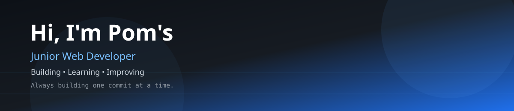

<p align="center">



</p>

<h1 align="center">

Hi, I'm Pom's 👋

</h1>

<h3 align="center">

Junior Web Developer • Information Systems Student

</h3>

<p align="center">

Building • Learning • Improving

</p>

<p align="center">


</p>

---

<!-- ======================================================== -->
<!--                      ABOUT ME                            -->
<!-- ======================================================== -->

## 👨‍💻 About Me

```yaml
Name      : Pom's
Role      : Junior Web Developer
Education : Information Systems Student
Location  : Yogyakarta, Indonesia

Current Learning:
  - HTML5
  - CSS3
  - JavaScript
  - Python
  - PHP
  - Git & GitHub

Goal:
  Become a Full Stack Developer 🚀
```

<!-- ======================================================== -->
<!--                     TECH STACK                           -->
<!-- ======================================================== -->

## 🚀 Tech Stack

> 💻 *The technologies I'm currently learning and using.*

<br>

### 🌐 Frontend Development

<p align="center">


</p>

<p align="center">

<sub>HTML5 • CSS3 • JavaScript</sub>

</p>

---

### ⚙️ Backend Development

<p align="center">


</p>

<p align="center">

<sub>Python • PHP</sub>

</p>

---

### 🛠️ Tools & Version Control

<p align="center">


</p>

<p align="center">

<sub>Git • GitHub • VS Code • Antigravity IDE</sub>

</p>

---

### 🎨 Design

<p align="center">


</p>

<p align="center">

<sub>Figma</sub>

</p>

---

<!-- ======================================================== -->
<!--                 CURRENT LEARNING                         -->
<!-- ======================================================== -->

## 📚 Current Learning

> 🚀 *Learning isn't about finishing, it's about improving every day.*

<br>

<table align="center">

<tr>

<td width="50%" valign="top">

### 🌐 Frontend

| Technology | Status |
|------------|--------|
|  HTML5 | 🟢 Comfortable |
|  CSS3 | 🟢 Comfortable |
|  JavaScript | 🟡 Learning |

</td>

<td width="50%" valign="top">

### ⚙️ Backend

| Technology | Status |
|------------|--------|
|  Python | 🟡 Learning |
|  PHP | 🌱 Beginner |
|  Laravel | ⏳ Planned |

</td>

</tr>

<tr>

<td width="50%" valign="top">

### 🛠️ Tools

| Tool | Status |
|------|--------|
|  Git | 🟢 Daily Use |
|  GitHub | 🟢 Daily Use |
|  VS Code | 🟢 Main IDE |
| 🚀 Antigravity IDE | 🟡 Exploring |

</td>

<td width="50%" valign="top">

### 🎨 Design

| Tool | Status |
|------|--------|
|  Figma | 🟡 Learning |

<br>

### 🎯 Current Goal

> 🚀 Become a **Full Stack Developer**

</td>

</tr>

</table>

---

<!-- ======================================================== -->
<!--                 FEATURED PROJECTS                        -->
<!-- ======================================================== -->

## 📌 Featured Projects

> 💡 *Projects I've built while learning web development.*

| 🚀 Project | 📝 Description |
|------------|----------------|
| 🌐 Business Landing Page | Responsive website using HTML, CSS & JavaScript |
| 📦 Inventory System | Simple CRUD application |
| 📝 Attendance System | PHP + MySQL |
| 💼 Portfolio Website | Personal branding website |
| 🚀 More Coming Soon... | Currently building new projects |

---

<!-- ======================================================== -->
<!--                  GITHUB ANALYTICS                        -->
<!-- ======================================================== -->

## 📈 GitHub Analytics

<p align="center">


</p>

<p align="center">


</p>

<p align="center">


</p>
